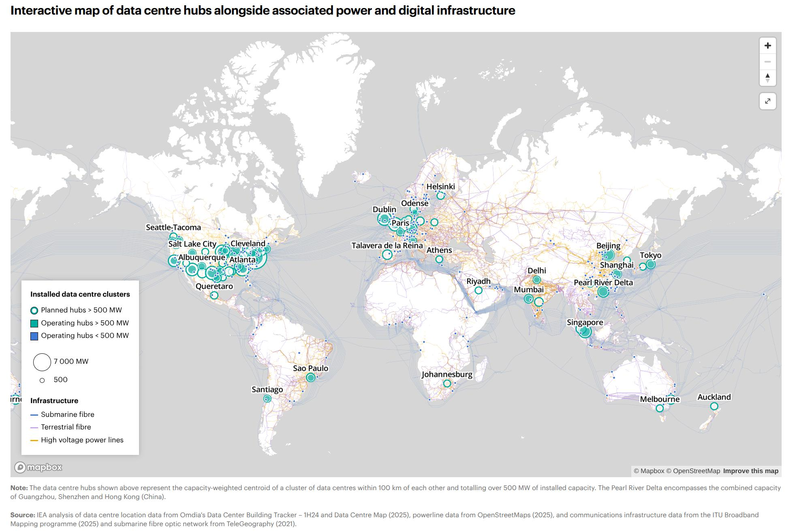
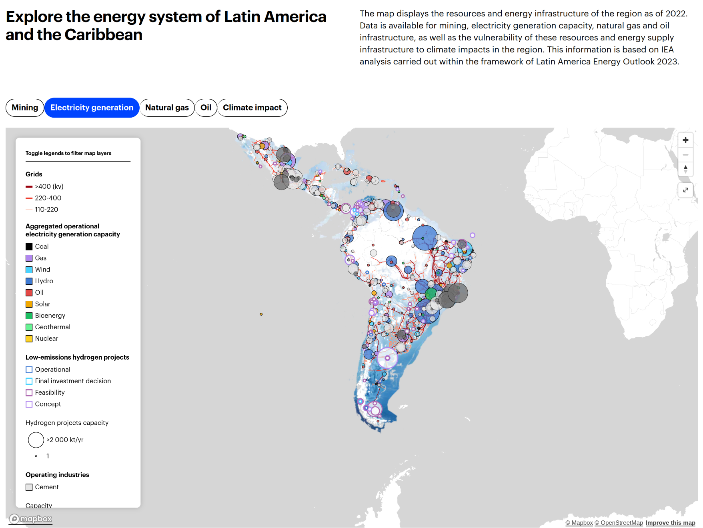
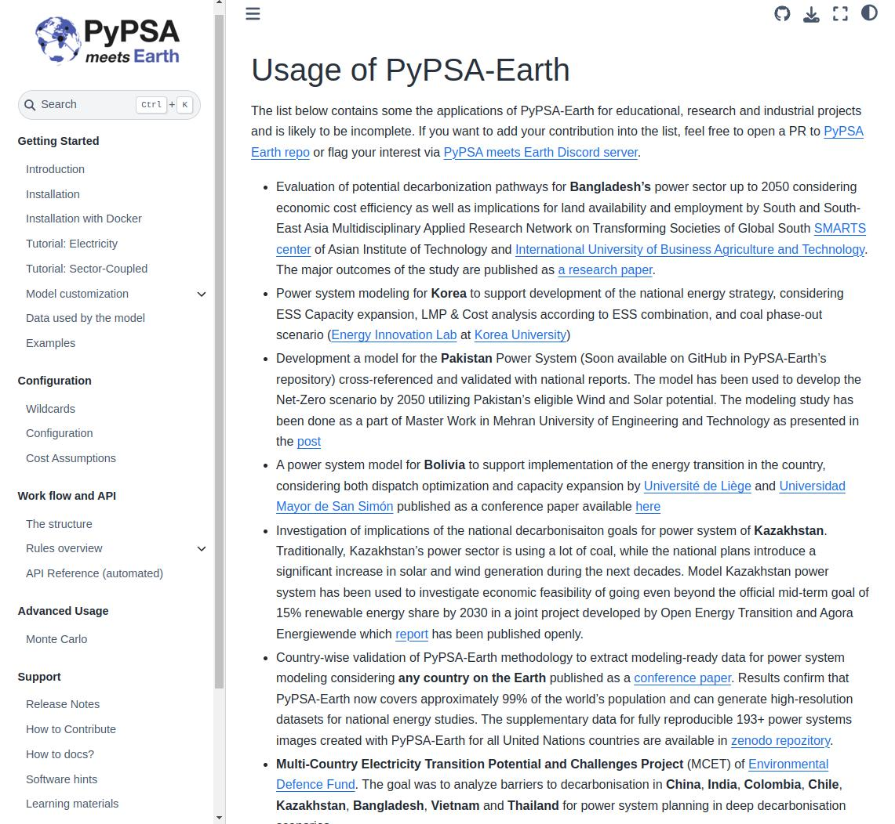
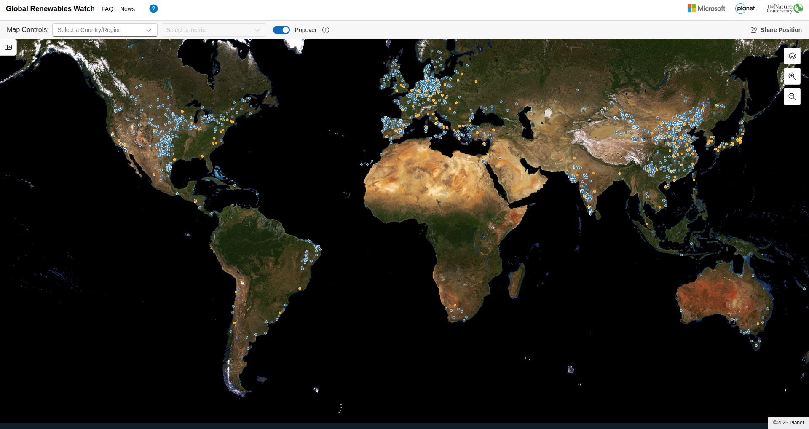
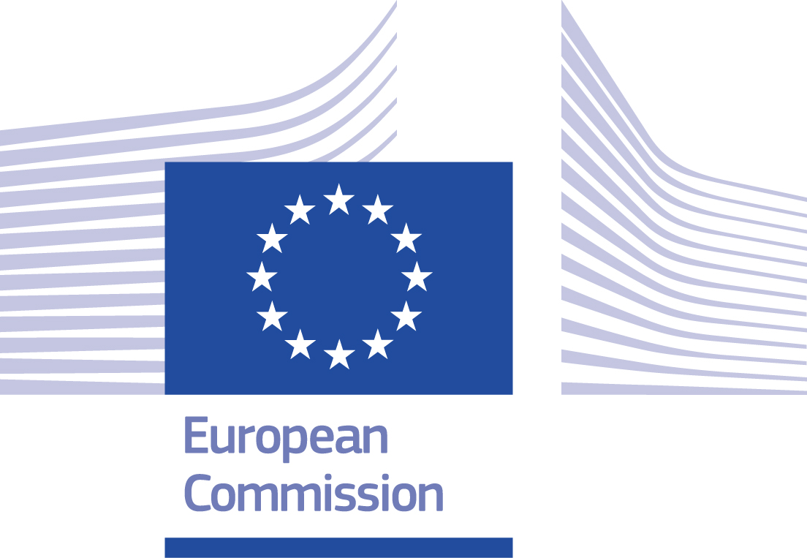
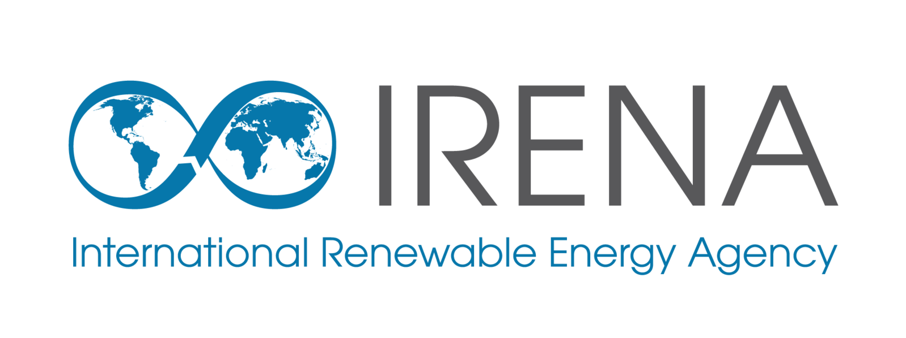
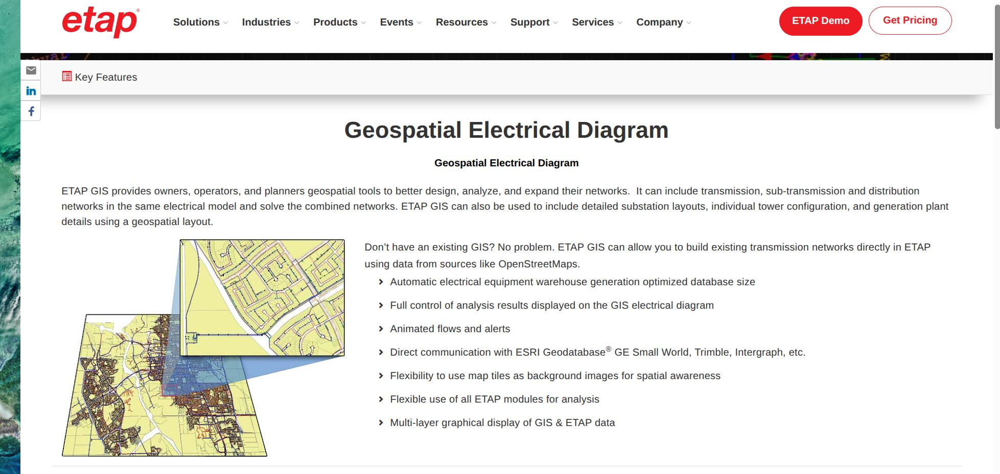
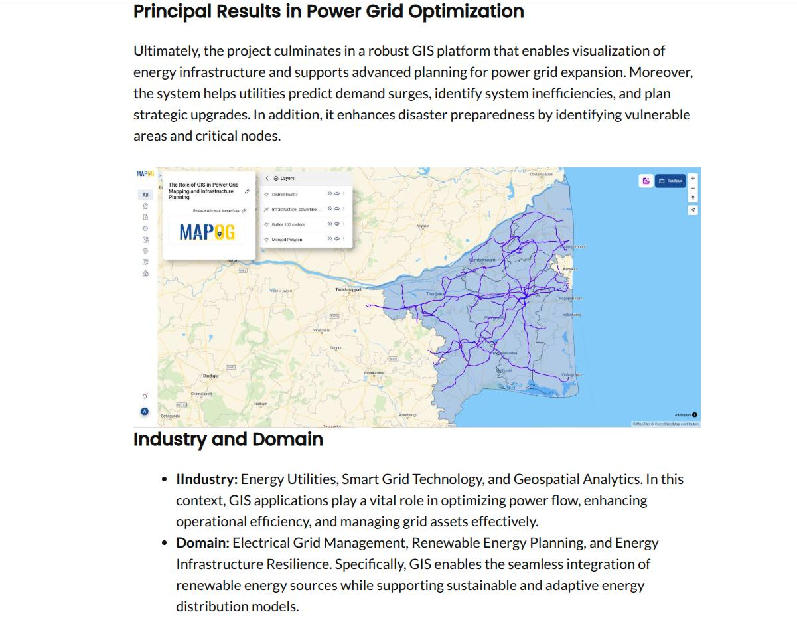
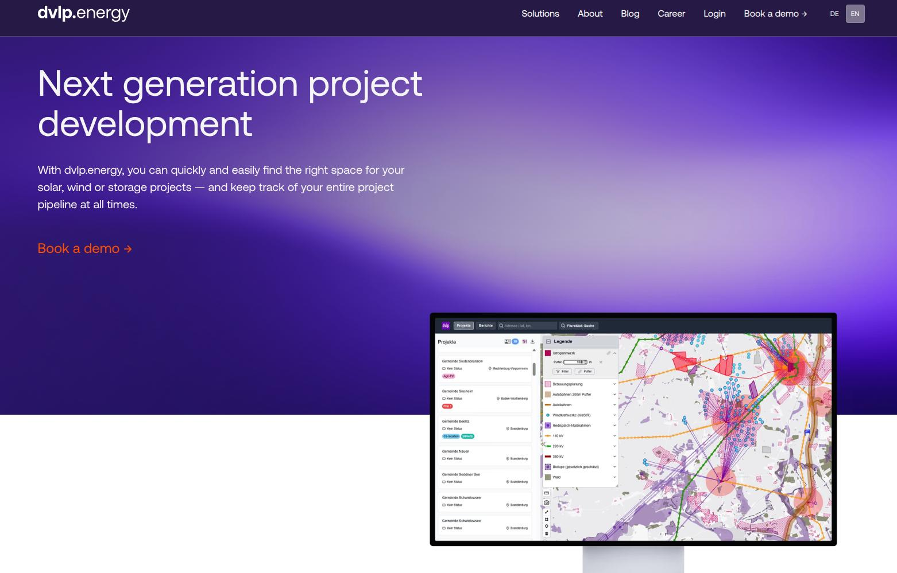

<h1>Impact </h1>

OpenStreetMap’s unique value in creating high quality data for sustainable development has been proven by multiple initiatives all around the world: 

  
  <figcaption class="image-caption">The PyPSA-Earth open-source energy system model uses OpenStreetMap data to study the future of energy around the world. Click to enlarge.</figcaption>

  
  <figcaption class="image-caption">The Energy planning of 58 countries like Pakistan directly depend on OpenStreetMap . Click to enlarge.</figcaption>

 

1. The [Global Electrification Platform](https://electrifynow.energydata.info/) and [Distributed Renewable Energy Atlas](https://dre.energydata.info/), developed and used by the World Bank, are used for planning electrification and expansion of renewable energy in rural areas across 58 countries. Using OpenStreetMap's transmission lines, roads, buildings, and settlements, it helps identify off-grid populations and informs planning for both grid and off-grid electrification strategies. gep-onsset, the Open Source Software behind Global Electrification Platform, [relies heavily on electrical grid data of OpenStreetMap](https://gep-onsset.readthedocs.io/en/latest/GIS%20data%20collection.html#infrastructure).

1. The [Humanitarian OpenStreetMap Team](https://www.hotosm.org/) provides high-quality, open geospatial data to inform decision-makers during early disaster response. More than 419,000 volunteer mappers have contributed to this initiative. The platform allows collaboration between multiple organizations, like satellite imaging providers like Maxar and humanitarian agencies such as the Red Cross. This collaborative platform ensures that critical, life-saving decisions are grounded in traceable and verifiable data. Especially as the frequency of extreme weather events increases, accurate electrical grid data [plays a key role in disaster response at the Humanitarian OpenStreetMap Team](https://github.com/USAFORUNHCRhive/turkana-grid-mapping).

1. The World Bank's [EnergyData.info](https://energydata.info/dataset/?q=OpenStreetMap) website hosts over 1,072 energy-related datasets, 533 of which directly depend on OpenStreetMap data. The World Bank uses this data to finance and support energy infrastructure projects in low- and middle-income countries, including expanding energy access, modernizing power systems, and promoting clean energy solutions. This data is been used to create report for Decision Makers such as [Mini Grids for Half a Billion People](https://www.esmap.org/sites/default/files/esmap-files/Mini%20Grids%20for%20Half%20a%20Billion%20People%20-%20OKR%20Download%20Version_compressed_MKA.pdf).

## **
How and Why is it used for the Electrical Grid?
**

OpenStreetMap’s electrical grid data is actively used by grid operators, academic institutions, government agencies, local authorities, and private organizations. This data plays a crucial role in energy modeling and planning, informing both policy development and investment decisions. 

These simulations help to evaluate technological options, the impact of policies, and the pathways to achieving full electrification, especially in developing countries. Energy models are essential for advancing decarbonization goals and achieving sustainable development. However, the effectiveness of these models depends heavily on the **quality and completeness of the data** they rely on.

--- 

### Energy Modelling 

  
  <figcaption class="image-caption">PyPSA combines transmission lines and substations (left) to form larger energy links and buses between different regions (right). Image Source: <a href="https://pypsa-earth.readthedocs.io/en/latest/index.html" target="_blank">Modelling the high-voltage grid using open data for
Europe and beyond</a></figcaption> 

 

[PyPSA-Earth](https://pypsa-earth.readthedocs.io/en/latest/index.html) is the first energy model to enable regional studies based on OpenStreetMap to be carried out across the globe. The data is clustered into larger regional electrical hubs to simplify the power system model and improve computational efficiency. However, the energy potential of entire regions is underestimated if lines and substations are missing. Therefore, improving the current state of the OpenStreetMap's electrical grid data significantly enhances the reliability and effectiveness of this planning tool for energy studies in [regions all around the world](https://pypsa-earth.readthedocs.io/en/latest/users_list.html#). Initial attempts to use OpenStreetMap data for energy modeling are being made by the German Aerospace Center with the [SciGrid](https://www.dlr.de/en/ve/research-and-transfer/projects/project-scigrid) project starting in 2014. Afterwards project like [OSMoGrid](https://github.com/ie3-institute/OSMoGrid), [GridTool](https://github.com/IEE-TUGraz/GridTool), [osmTGmod](https://github.com/wupperinst/osmTGmod) and [OpenGridMap](https://github.com/opengridmap) have continued this development first focusing on the German electrical grid.

--- 

###  Valued by International Organizations

Organizations such as the **World Bank** and the **International Energy Agency (IEA)** rely on OpenStreetMap data for regional and continental energy analyses. In many cases, OpenStreetMap provides the **only available** source of open, accessible infrastructure data. Making such data publicly available adds considerable **societal value** for planning and clean energy transitions, while also creating **economic value** for the private sector:

   </a>
  <figcaption class="image-caption"> More than 240 million people in Nigeria depend on electrical grid data from OpenStreetMap. The <a href="https://pypsa-earth.readthedocs.io/en/latest/index.html" target="_blank">Nigerian SE4ALL website</a>, which is hosted by the Federal Ministry of Power, uses OpenStreetMap as its main source on the transmission grid.</figcaption> 

 

> **IEA Key Policy Recommendation in 2024:**
> “Improve data reliability and availability to better assess and manage risks for clean energy projects in emerging markets and developing economies.”             
[How to implement the COP28 energy goals](https://www.iea.org/events/from-taking-stock-to-taking-action-how-to-implement-the-cop28-energy-goals) 
--- 
> **IEA Actionable Recommendation in 2025:**
> “Policy makers, regulators and utilities must support institutions, regulations, technical standards and collaboration platforms to build consensus on effective planning approaches that take full account of the changes in the profiles of power systems and their operations. Encouraging Transmission System Operator to share procurement and capacity planning data with regulators will further support informed policymaking.           
[Building the Future Transmission Grid](https://iea.blob.core.windows.net/assets/a688d0f5-a100-447f-91a1-50b7b0d8eaa1/BuildingtheFutureTransmissionGrid.pdf)
--- 
> **United Nations ESCAP Recommendations in 2025**
> "Open access to non-sensitive energy data, **including geospatial mapping of grids**, renewable resource availability, and interconnection status, would also facilitate more inclusive stakeholder engagement and private sector participation. Transparent data
practices are especially important for regional collaboration, as they allow neighboring countries to align plans, assess complementarities, and coordinate investments.      
[The Role of Grids in Energy Transitions](https://repository.unescap.org/server/api/core/bitstreams/e0660cc4-796d-42f9-a020-9bd2d915f267/content)

--- 

### Energy Grids Shape Our Future

  
  <figcaption class="image-caption">Expanding and replacing transmission lines is vital to achieving global climate goals. By 2050, advanced economies aim to nearly double their grid capacity, while emerging economies plan to triple theirs. <a href="https://iea.blob.core.windows.net/assets/a688d0f5-a100-447f-91a1-50b7b0d8eaa1/BuildingtheFutureTransmissionGrid.pdf">IEA</a>, CC BY 4.0. Click to enlarge.</figcaption>

 

Reliable and open infrastructure data directly supports the **adoption and success of clean energy projects** globally. These projects are being accelerated for several critical reasons:

* **Climate mitigation:** Fossil fuels account for roughly 70% of global greenhouse gas emissions.
* **Resilience:** Clean energy strengthens resilience against climate impacts and extreme weather events.
* **Energy security:** Reducing reliance on imports enhances national energy independence, especially from politically unstable or hostile regions.

--- 

### Growing Academic Impact

To assess the influence of OpenStreetMap electrical grid data in research, we analysed Google Scholar for publications combining `OpenStreetMap` with terms like `power grid`, `electrical grid`, `renewable` or `energy model`.

* 10,700 publications since 2005 included combinations of these keywords.
* A total of **2,460 publications** were released in the last year alone, demonstrating a rapid increase in academic engagement with, and recognition of, the power of OpenStreetMap data.

## **
Why is it Important that this Data is Open?
**

Access to open and accurate data on electricity infrastructure is essential for effective planning, development, and collaboration, especially in the context of the global energy transition. The benefits are far-reaching, particularly for developing countries and emerging economies.

### Bridging Data Gaps in Developing Countries

  
  <figcaption class="image-caption"> <a href="https://iea.blob.core.windows.net/assets/a688d0f5-a100-447f-91a1-50b7b0d8eaa1/BuildingtheFutureTransmissionGrid.pdf" target="_blank"> Ember - Africa Electricity Data Transparency 2025 </a>- Click to enlarge.</figcaption>

 

In many low- and middle-income countries, data on electrical infrastructure is **outdated, incomplete, or fragmented**. This presents a significant barrier for governments, utilities, and planners. Even in high-income countries, while data may be more comprehensive, it is often **not publicly available** or limited by restrictive licensing. This hinders transparency and the ability to collaborate or validate results.

Open data ensures that:

* Infrastructure planning is **more inclusive and cost-effective**.
* Datasets can be **cross-checked, reused, and improved** collaboratively.
* Policymakers and planners have **a reliable foundation** for decision-making.

--- 

### Transparency, Traceability and Public Trust

OpenStreetMap's unique mapping methodology, which cannot be replicated by proprietary mapping services using closed methods, enables traceability and [verifiability](https://wiki.openstreetmap.org/wiki/Verifiability): 

> "At the core, "verifiability" is that everything you do can be demonstrated to be true or false by other mappers."

Transparent planning, backed by open data, plays a key role in building **public trust**. Research has shown that openness increases public acceptance of infrastructure projects ([Ciupuliga & Cuppen, 2013](https://www.sciencedirect.com/science/article/abs/pii/S0301421513003601)).

Because OpenStreetMap is editable and collaborative, **local communities, NGOs, and governments** can contribute directly. This  leads to filling gaps, correcting errors, and improving the quality of infrastructure data. For example, the **YouthMappers** initiative in **Sierra Leone** enabled local students and organizations to map the power grid, helping electricity providers reduce planning costs and improve infrastructure deployment ([Charles, 2022](https://link.springer.com/chapter/10.1007/978-3-031-05182-1_11)).

Open grid data is also instrumental in identifying **off-grid communities** that could be connected to national networks, helping target interventions and investments ([Arderne et al., 2020](https://www.nature.com/articles/s41597-019-0347-4)).

--- 

### Economic Savings Compared to Proprietary Datasets 

  
  <figcaption class="image-caption">Creating Foundation Electric Energy Infrastructure Data from Open-Sources document. Click to enlarge.</figcaption>

 

OpenStreetMap's data has enabled the government and local authorities to create high-quality datasets without having to pay for expensive proprietary ones. For example, the US Department of Energy and partners have created the "Electric Energy Infrastructure Data" utilising open-source data, which led to **"estimated savings of 65% (~2 million dollars) over proprietary datasets"** ([Singh et al., 2023](https://www.energy.gov/sites/default/files/2023-01/poster-%20Creating%20Foundation%20Electric%20Energy%20Infrastructure%20Data%20from%20Open-Sources.pdf)).

--- 

### Examples from High-Income Countries
In most developed countries, publishing high-resolution, open datasets about the transmission grid has been common practice more than a decade. For example:

* [**ENTSO-E**](https://www.entsoe.eu/data/map/) provides a Europe-wide **Transmission System Map** with geo-referenced infrastructure data.
* The French grid operator **RTE** publishes its grid topology, including **5-minute resolution time-series data** on network operations ([RTE on GitHub](https://github.com/rte-france/structural-french-grid-data-with-detailed-topology-time-series)).
* Enedis, the French distribution system operator committed to Open Data since 2015, is [joining forces with OpenStreetMap France](https://www.enedis.fr/presse/open-data-enedis-participe-un-projet-collaboratif-mondial-dechange-de-donnees) to make its grid data available and encourage crowdsourcing.
* To find more open datasets about the electrical grid released by national authorities or electrical grid operators, check out our [curated a list](https://github.com/open-energy-transition/Awesome-Electric-Grid-Mapping) with more than 150 maps.

  
  <figcaption class="image-caption">
    Comparison of U.S. Homeland Infrastructure Foundation-Level Data (gray lines) with OpenStreetMap transmission data (green lines) shows matching spatial resolution. Click to enlarge.
  </figcaption>

In the United States, the Department of Homeland Security and other agencies publish national transmission grid data to support **emergency response, policy development, and economic planning**. These open datasets trace back to legislation from the 1990s that aimed to improve geospatial data sharing ([source](https://www.govinfo.gov/content/pkg/WCPD-1994-04-18/pdf/WCPD-1994-04-18-Pg779.pdf)). Within this dataset, 24% of US transmission lines state OpenStreetMap as their main source.

The [Homeland Infrastructure Foundation-Level Data](https://resilience.climate.gov/datasets/fedmaps::u-s-electric-power-transmission-lines/explore?location=38.846475%2C-76.984997%2C8.86) has shown **strong alignment** with OpenStreetMap data, demonstrating how open contributions can match official datasets in coverage and accuracy.

## **
Who uses OpenStreetMap Grid Data?
**

How does mapping have an impact? When you map towers, substations, power plants in OpenStreetMap, you are essentially adding valuable data that is used by many different entities. Below is a curated list of organisations and projects that have had an impact and have used this data.   

Disclaimer: These organisations are not affiliated with MapYourGrid nor endorse it. All logos and brand names are the property of their respective owners. Usage here is for informational purposes only, identifying organisations that utilise OpenStreetMap data.

**International Energy Agency**  {width=30px} 
??? "Energy and AI Observatory (Click Me)"
    
    [**Link to website**](https://www.iea.org/data-and-statistics/data-tools/energy-and-ai-observatory)
    
    {: .img-border }
 
??? "Latin America Energy Outlook Interactive Map (Click Me)"
    
    [**Link** - Latin America Energy Outlook Interactive Map (link)](https://www.iea.org/data-and-statistics/data-tools/latin-america-energy-outlook-interactive-map)
        
    {: .img-border }

**US Department of Homeland Security**  {width=30px} 
??? "Homeland Infrastructure Foundation-Level Data (HIFLD) (Click Me)"
    
    [**Link to website**](https://hifld-geoplatform.hub.arcgis.com/datasets/3486fb60feb2454c99232248fdf624ec_0/explore)
    
    {: .img-border }

**World Bank**  {width=70px} 
??? "Africa Electricity Grids Explorer (Click Me)"
    
    [**Link** - Africa Electricity Grids Explorer (link)](https://africagrid.energydata.info/)
    
    {: .img-border }

**PyPSA-Earth** {: width=70px} **+** **PyPSA-Eur** {: width=30px}
??? "PyPSA-Earth and Europe use OpenStreetMap data for energy system studies all around the world. (Click Me)"
    
    [**Link to website**)](https://pypsa-earth.readthedocs.io/)
        
    {: .img-border }

**Enedis**  {width=70px} 
??? "The French utility company Enedis, operating the electricity distribution network, mapped power poles and substations with the help of a strong local OpenStreetMap community. (Click Me)"
    
    [**Link to website**](https://enedis.openstreetmap.fr/)
        
    {: .img-border }

**Global Renewables Watch**  {width=70px} 
??? "The Global Renewables Watch maps and measures renewable energy installations and their estimated capacities at the subnational, national, and global levels. The machine learning behind the detection process is mainly trained using OpenStreetMap data. (Click Me)"
    
    [**Link to website**](https://www.globalrenewableswatch.org/)
        
    {: .img-border }
 
**CONAHCYT (Gobierno de Mexico)**  {width=70px} 
??? "Mapa del Sistema Eléctrico Nacional (Click Me)"
    
    [**Link to website**](https://energia.conacyt.mx/planeas/electricidad/sistema-electrico-nacional)
    
    {: .img-border }
 
**European Commission - Joint Research Centre**  {width=40px} 
??? "Africa Knowledge Platform (Click Me)"
    
    [**Link to website**](https://africa-knowledge-platform.ec.europa.eu/explore_maps)
    
    {: .img-border }

    **More Information**
    - The electricity network data on the image is a mix of World Bank and OpenStreetMap data 
 
**IRENA**  {width=55px} 
??? "Global Atlas for Renewable Energy (Click Me)"
    
    [**Link to website**](https://globalatlas.irena.org/workspace)
        
    {: .img-border }
 
**Global Wind Atlas**  {width=15px} 
??? "Global Wind Atlas (Click Me)"
    
    [**Link to website**](https://globalwindatlas.info/en/)
        
    {: .img-border }

**Fraunhofer ISE**  {width=45px} 
??? "Energy Charts (Click Me)"
    
    [**Link to website**](https://www.energy-charts.info/map/map.htm?l=en&c=DE&country=DE&lines=1110000&pp-source=bnetza&pp-bitmap=none)
    
    {: .img-border }

**ESMAP, IFC, VIDA** {width=45px} {width=65px} {width=45px}
??? "Distributed Renewable Energy (DRE) Atlas (Click Me)"
    
    [**Link to website**](https://dre.energydata.info/)
        
    {: .img-border }

**GridRaven** {width=15px} 
??? "Dynamic Line Ratings with precision weather forecasting (Click Me)"
    
    [**Link to website**](https://claw.gridraven.com/world)
        
    {: .img-border }

**windPRO** {width=15px}
??? "windPRO is an industry standard for designing, planning, and evaluating wind and solar energy projects. (Click Me)"
    
    [**Link to website**](https://help.emd.dk/mediawiki/index.php/EMD_Electrical_Grid_Map)
        
    {: .img-border } 

**ETAP** {width=25px}
??? "ETAP® provides market-leading software and hardware solutions serving all stages of the electrical system lifecycle for utilities, infrastructure, industries and buildings. (Click Me)"
    
    [**Link to website**](https://etap.com/product/gis-for-electric)
    
    {: .img-border } 

**GlitreNett** {width=40px}
??? "DataArena intends to inform and provide information about the status of the Norway electrical grid capacity. (Click Me)" 
    
    [DataArena intends to inform and provide information about the status of the Norway electrical grid capacity.](https://etap.com/product/gis-for-electric)
        
    {: .img-border } 

**MAPOG** {width=40px}
??? "How GIS Enhances Power Grid Mapping and Energy Infrastructure Planning. (Click Me)" 
    
    [**Link to website**](https://www.mapog.com/power-grid-and-infrastructure-mapping-and-planning-using-gis/)
        
    {: .img-border } 

**dvlp.energy** {width=40px}
??? "With dvlp.energy, you can quickly and easily find the right space for your solar, wind or storage projects. (Click Me)" 
    
    [**Link to website**](https://www.dvlp.energy/en)
        
    {: .img-border } 

**Roseau Technologies** {width=40px}
??? "Modern and ergonomic software solutions for straightforward electricity distribution grid design. (Click Me)" 
    
    [**Link to website**](https://www.roseautechnologies.com/en/home/)
        
    {: .img-border } 

## **
Responsible Grid Mapping: Understanding Risks and Mitigation?
**

Openly mapping electricity transmission infrastructure is essential to achieving universal energy access, strengthening climate resilience, and enabling clean energy planning. But openness, especially in the realm of infrastructure, naturally raises questions about risk and security.

At MapYourGrid, we take these concerns seriously. This section explains the actual risks associated with open grid data, why the benefits of responsible mapping outweigh those risks, and how we mitigate potential harms through careful, community-informed practices. For the past 17 years, transmission grid data has been created on a global
scale in OpenStreetMap without any major legal issues being identified. MapYourGrid is closing the gap for low-to-medium income countries, helping them to increase their coverage from around 70% to 98%.

---

### Why Infrastructure Mapping Raises Concerns

Electric transmission infrastructure is widely regarded as critical to national and regional stability. It powers economies, supports healthcare systems, and connects communities. Given this, stakeholders often ask: does publishing maps of power lines and substations expose a system to new threats?

This is a valid concern. While OSM mapping focuses only on non-sensitive, publicly visible features, it’s important to understand where the line is drawn.

---

### Most Grid Infrastructure Is Already Publicly Visible

In practice, the vast majority of grid infrastructure is already accessible through:

- Satellite imagery platforms like Google Earth and Bing Maps
- National and regional planning documents
- Government datasets, such as the U.S. HIFLD database or the EU's ENTSO-E platform
- Commercial mapping services, which label substations and sometimes show transmission corridors

OpenStreetMap does not introduce new forms of visibility through raw imagery, but rather derives new data from it that could have been created using similar imagery for almost 20 years. This ensures high quality through traceability and verifiability. OpenStreetMap provides structured, standardised, openly licensed data that is accessible to communities, researchers, planners and public institutions.

---

### The Bigger Risk: A Lack of Data

   
  <figcaption class="image-caption">
     <a href="https://ember-energy.org/latest-insights/asia-data-transparency-report-2023/" target="_blank">Based on the Asia Data Transparency Report by Ember</a>, a large part of South East Asia lacks public energy data.
  </figcaption>
</figure>

 

For much of the world, the absence of reliable, accessible grid data is a more urgent risk than openness. In countries with expanding populations, growing urban centers, or rural electrification needs, decisions about where to invest in infrastructure depend on having accurate spatial data.

Without it:

- Electrification efforts stall due to uncertainty in grid reach and capacity
- Renewable energy developers face delays or suboptimal siting
- Emergency response teams cannot plan around real-world grid layouts
- Public agencies lack the tools to ensure transparency and resilience

Mapping transmission infrastructure in OpenStreetMap helps close this data gap.

---

### Our Approach to Risk Mitigation

We don’t treat risk lightly. MapYourGrid implements a layered, context-aware framework to ensure that mapping serves the public good while respecting national sensitivities and community priorities. Read more about this in our [Code of Mappers](./code-of-mappers.md).

#### Community Consent and Local Alignment

We motivate mappers to engage directly with regional OpenStreetMap communities. We provide training, host collaborative events, and support in-country mapping leaders to ensure that each initiative reflects local knowledge, laws and priorities.

#### Clear Boundaries on What We Map

   
  <figcaption class="image-caption">
     Typical resolution of Satellite images (ESRI) and Mapping Resolution of a Kenya Substation in OpenStreetMap. Lines end with portals at substations. No internal routing and components are mapped. 
  </figcaption>
</figure>

 

We focus strictly on features that are:

- Publicly observable in satellite imagery
- Energy planning-relevant and appropriate for open mapping

This includes **power line routes, tower locations, substation boundaries, and voltage classifications.** 

We explicitly do **not** map:

- Substation interiors or fencing
- Control systems or communications infrastructure
- Security or surveillance features

This boundary ensures that OSM grid data is useful without compromising operational or physical security. Detailed mapping of busbars, detailed routing and circuits within substations should only be carried out in collaboration with local mappers and utility operators.

#### Data Validation and Version Control

Every contribution to OpenStreetMap is timestamped, attributed, and fully reversible. The OSM platform includes built-in tools to detect suspicious edits, and MapYourGrid-supported projects include an additional layer of human quality control, expert review, and automated validation tools.

This model promotes transparency and reduces the risk of error or malicious contributions going unnoticed.

### What the Evidence Tells Us

Research and operational experience from agencies like the U.S. Department of Energy and the International Energy Agency show that most power grid disruptions come from:

- Extreme weather events
- Maintenance failures and aging infrastructure
- Insufficient coordination across jurisdictions

While physical and cyber threats do exist, they are typically unrelated to the kind of public infrastructure data found in OpenStreetMap. In fact, a lack of data often worsens the consequences of these risks by delaying coordination and limiting visibility during crises.

---

### Comparative Overview

| Dataset                     | Access            | Source                             | Security Level   | Grid Coverage           |
|-----------------------------|-------------------|-------------------------------------|------------------|-------------------------|
| OpenStreetMap (OSM)         | Public             | Community + public imagery          | Moderate          | Transmission + Distribution |
| HIFLD (US DHS)              | Public/Restricted  | Government + OSM-derived            | Controlled         | Transmission only       |
| CEII (FERC, U.S.)           | Restricted         | Grid operators                      | High               | Transmission only       |

OpenStreetMap data is often used to validate or supplement these official datasets, not replace them.

---

   
  <figcaption class="image-caption">
      The <a href="https://link.springer.com/article/10.1007/s13753-024-00573-7">"Risk of Tropical Cyclones and Floods to Power Grids in Southeast and East Asia" </a> study uses OpenStreetMap infrastructure data to estimate expected annual damages to power‑grid assets from tropical cyclone winds and coastal floods.
  </figcaption>
</figure>

 

### Supporting Responsible Openness

For donors, researchers, and institutions that want to support open infrastructure data while mitigating risk, we recommend the following:

**Do:**

- Emphasize climate resilience, public benefit, and equity
- Highlight real-world examples where open data improved planning or disaster response
- Work closely with regional stakeholders and community mappers
- Fund training, peer review, and documentation improvements

**Avoid:**

- Supporting mapping in high-conflict areas
- Treating openness as an all-or-nothing issue
- Understating the need for careful stewardship and legal awareness

---

### Final Thoughts

Transmission grid mapping in OpenStreetMap is already contributing to real-world progress: From modeling electrification pathways in sub-Saharan Africa to enabling renewable energy siting in Southeast Asia.

By balancing transparency with care, and openness with accountability, we believe it's possible to expand access to infrastructure data while minimizing risk. The global clean energy transition depends on this kind of open, responsible collaboration.
